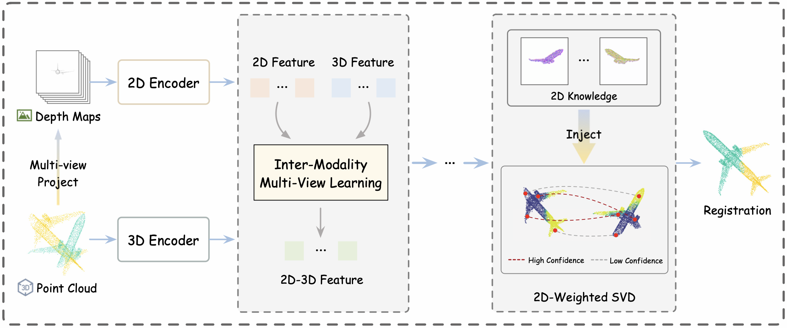

# [AAAI 2025] Partial Point Cloud Registration with Multi-view 2D Image Learning

_**Yue Zhang**, Yue Wu, Wenping Ma, Maoguo Gong, Hao Li, Biao Hou_

Welcome to the official PyTorch implementation repository of our paper [Partial Point Cloud Registration with Multi-view 2D Image Learning](https://ojs.aaai.org/index.php/AAAI/article/view/33121)

We will update the code soon.
<div style="text-align: center">

</div>

## Citation

If you find the paper useful, please consider citing:

```
@inproceedings{zhang2025partial,
  title={Partial Point Cloud Registration with Multi-view 2D Image Learning},
  author={Zhang, Yue and Wu, Yue and Ma, Wenping and Gong, Maoguo and Li, Hao and Hou, Biao},
  booktitle={Proceedings of the AAAI Conference on Artificial Intelligence},
  volume={39},
  number={10},
  pages={10329--10337},
  year={2025}
}
```
### Acknowledgments
In this project we use (parts of) the official implementations of the followin works: 

- [PREDATOR](https://github.com/prs-eth/OverlapPredator) (Dataset)
- [REGTR](https://github.com/yewzijian/RegTR) (Network)
- [KPConv](https://github.com/HuguesTHOMAS/KPConv-PyTorch) (Backbone)

 We thank the respective authors for open sourcing their methods. 
